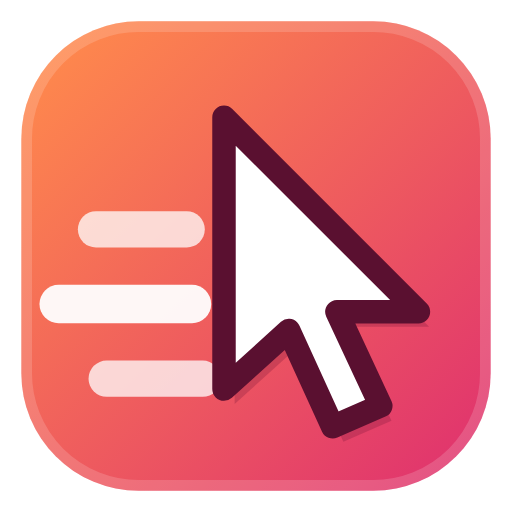
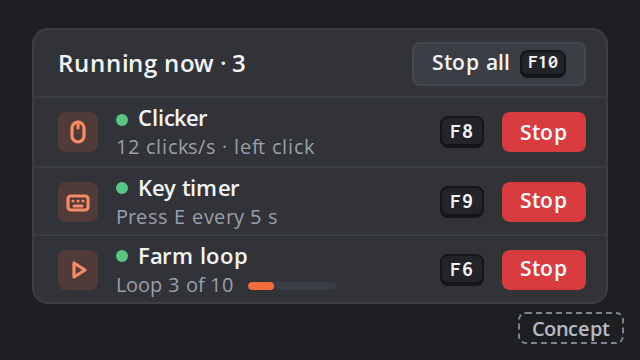
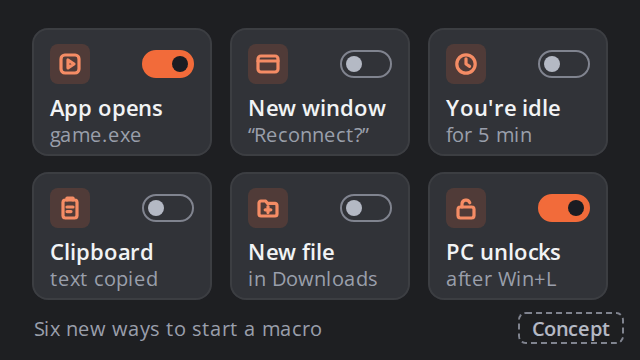
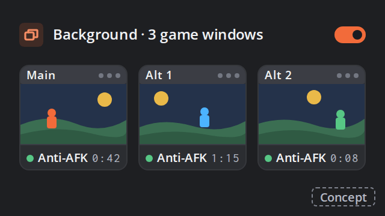
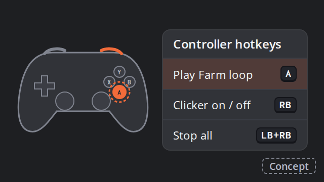
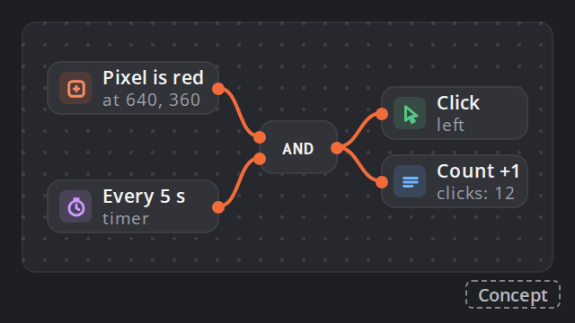
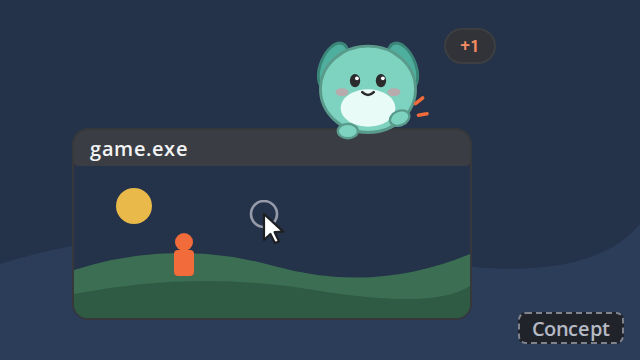

# AutoClicker + AutoKey

A keyboard + mouse macro recorder and autoclicker for Windows 10 / 11.

**[⬇ Download the latest version](../../releases/latest)** — the installer (`AutoClickerAutoKey-Setup-….exe`)
or just the app (`AutoClickerAutoKey.exe`, no install needed). Already have it? Click the green version badge in the
app and it updates itself; updates are signed by the developer and checked before they're installed.
Windows may show *"Windows protected your PC"* the first time because the app isn't code-signed:
click **More info → Run anyway**.

**Only download it from this page** — copies on other sites may be fake. Every release lists the SHA-256 checksum of
`AutoClickerAutoKey.exe`; in the app, **Settings › About & feedback › Copy SHA-256** gives the checksum of the copy you
run, so you can compare the two. The *Official download* link next to it opens this page.

## What it does

- **Record & replay** keys, clicks, mouse movement and the scroll wheel with exact timing — loop it,
  speed it up, edit any step.
- **Smart steps** — wait for a picture or some text to appear on screen (and click it), If / else, Repeat and
  Random blocks, counters, open apps, chain macros, type text with {date} or {clipboard}, move and minimize windows,
  copy and paste, volume, pause.
- **Autoclicker** — click / hold / key / rapid fire modes, fixed spots or sequences, bursts, random timing between
  two numbers, pause and resume.
- **Background clicking** — click and type into your game window while you use the mouse for something else, even
  when it's minimized. For games that need the real mouse, like Roblox, it can bring the game to the front for a
  moment while you're not using the PC.
- **Remap keys and text shortcuts** — Caps Lock as Esc, the Windows key off, a side mouse button as Ctrl+C; type
  “btw” and get “by the way”. Everywhere, only in your game, or in one program.
- **Triggers** — run on a schedule, or when a pixel, a picture, some words or a sound show up; ready-made anti-AFK and
  reconnect triggers.
- **Share codes** — share a macro as one line of text. Before you play someone else's, the app lists every
  program it opens and what's risky about it.
- **Discord alerts** — a message in your Discord channel when a macro finishes, something stops or a trigger
  starts a macro.
- **Start from a shortcut** — `--play "Farm"`, `--clicker "Fast"` or `--stop` from a desktop shortcut, the Task
  Scheduler or a Stream Deck button.
- **Level up** — levels to 100 with a new rank every 5, and prestige. 17 achievement tracks from Bronze to Master
  (plus one-offs and secrets), each adding to your XP bonus; about 115 titles, the rarest with colours that flow; a
  Pet den with toys, eggs and an upgrade shop, whose pets boost your XP; daily and weekly quests; 31 accent colours
  (8 free, the new Dash look by default) and **My tab** from level 10.
- **Test your hand** — CPS, reaction and aim tests, and a heat map of where the app clicked.
- **Online leaderboard** (optional) — level, weekly XP with leagues, the CPS, reaction and aim tests, and streaks.
  Off until you join; then only your chosen name, title and showcase, those scores and which achievements you've
  unlocked (to show how rare each one is) are sent, never what you type or record.
- **Hotkeys, presets, per-game profiles**, game-window lock, fail-safe, mini mode, dark and light theme.

## Portable mode

Want it on a USB stick, or nothing in your user folder? Put `AutoClickerAutoKey.exe` in a folder of its own and create
an empty file named **`portable.txt`** next to it (if Explorer hides file extensions, make sure it isn't called
`portable.txt.txt`). Everything the app saves then goes into a **`Data`** folder next to the .exe, and
*Settings › About & feedback* shows **Portable**.
- To take your current setup along: *Settings › Backup & data › Back up…* in your usual copy, then *Restore…* in the
  portable one.
- A portable copy adds no Start menu shortcut. *Start with Windows* still works if you turn it on.
- Your Discord webhook link and leaderboard login are encrypted for your Windows account, so they don't move to
  another PC: there, paste the webhook link again and join the leaderboard again.

## What the app sends

The app only goes online for these:
- **Update check** → GitHub, when the app starts (you can turn that off) and when you press *Check now*.
- **Online leaderboard** → the app's server, only after you join: your leaderboard name and scores, and which
  achievements you've unlocked (to show how rare each one is).
- **Discord alerts** → your own Discord channel, only if you paste a webhook link.
- **Bug reports and suggestions** → only when you press *Send*.

What you type, record or click is never sent. **Offline mode** (*Settings › About & feedback*) turns all of it off —
check with a firewall if you like.

## What's next

Some of what's planned, with rough sketches of how it might look. The whole list is in the app:
*Settings › About & feedback › Roadmap*. Plans can change — and your ideas help decide what comes first.

<table>
<tr>
<td> 
<b>Run several things at once</b> — the clicker, key timers and a macro together, each with its own hotkey and stop.</td>
<td> 
<b>More triggers</b> — start a macro when an app opens, a window appears, you're idle, a file arrives or the PC unlocks.</td>
</tr>
<tr>
<td> 
<b>Several game windows at once</b> — anti-AFK in two or three game windows, all in the background.</td>
<td> 
<b>Controller support</b> — record and play controller buttons, or use them like hotkeys.</td>
</tr>
<tr>
<td> 
<b>Blocks board</b> — wire blocks together, with logic, memory and timers, to build your own automations.</td>
<td> 
<b>Desktop buddy</b> — a pet that sits on your desktop and taps along with you. Off by default.</td>
</tr>
</table>

## Found a bug or want a feature?

Use **Settings › About & feedback** in the app: **Send to the developer** sends it straight from the app (answers
show up under *Messages & suggestions*), or **Open GitHub issue** opens a ready-made issue here with everything
needed to fix it (you can include the app log). Or open an issue directly:
[report a bug](../../issues/new?labels=bug&title=%5BBug%5D%20) ·
[request a feature](../../issues/new?labels=enhancement&title=%5BFeature%5D%20)

## Changelog

See the [releases](../../releases) — the app also shows *What's new* after each update.

---
This repository holds the downloads and issues. The source code is private.
© 2026 Anton Larsson — see [LICENSE](LICENSE).
